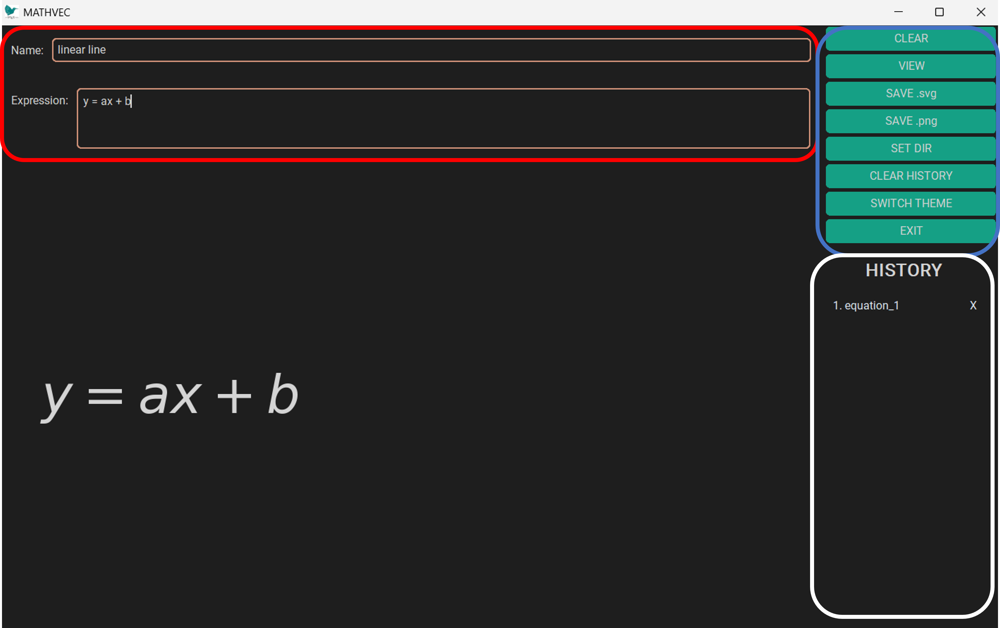

# MATHVEC

This little project is there to make .svgs out of math text.

## Requirements
Python 3.10+, tkinter (usually a standard library), and a LaTeX distribution (e.g. TeX Live or MiKTeX) available on your PATH. Also note, specifically the following LaTeX packages are used:
- asmath

## User Interface


In the input-pane (image: red), there are two text fields. The first is **Name** for the name of the expression, by default `equation_1`. The second is the actual **Expression**, which can be any LaTeX math. Comparing to actual LaTeX code, options are fairly limited (only core math and matrices, no equations, etc.) but I aim to extend on that soon. Below that input box, there's the **Canvas**, which shows a preview of the input text (not fully LaTeX but rather matplotlib math style).

On the right, the button-pane (image: blue) contains 5 buttons:
- `CLEAR`: resets the app. everything is removed from memory, except the path. So, if it has been adjusted with the button `SET dir` before, you will still be in that directory.
- `VIEW`: creates a **Figure** in a separate window, that shows proper LaTeX output.
- `SAVE .svg`: saves a figure equivalent to the one seen when pressing `VIEW` in the directory output_path under the name **Name** in `svg` format.
- `SAVE .png`: saves a figure equivalent to the one seen when pressing `VIEW` in the directory output_path under the name **Name** in `png` format.
- `SET dir`: adjusts output_dir.

Finally, below the button-pane, there is the history-pane (image: white). When equations are previewed or saved, they get added to the history which can be accessed here.

## Getting started

```bash
# 1. clone the repo
git clone https://github.com/stends2001/mathvec.git
cd mathvec

# 2. create and activate a virtual environment
python3 -m venv .venv
source .venv/bin/activate      # on Windows: .venv\Scripts\activate

# 3. install the project and its dependencies
pip install -e .

# 4. run the app
python runapp.py
```

Output files land in `output/` and expression history in `history/` (both created automatically, both git-ignored).

## Project Structure
```
mathvec
├── assets
├── config
│   └── config.yaml
├── history
│   └── history.tsv
├── output
└── src
    ├── backend
    │    ├── latex_validation.py
    │    └── pathmanager.py    
    └── frontend
         ├── buttonmanager.py
         ├── colorpalette.py        
         ├── configmanager.py    
         ├── core.py    
         ├── figuremanager.py    
         ├── historymanager.py   
         ├── popupmanager.py       
         ├── savemanager.py       
         └── windowmanager.py       
```